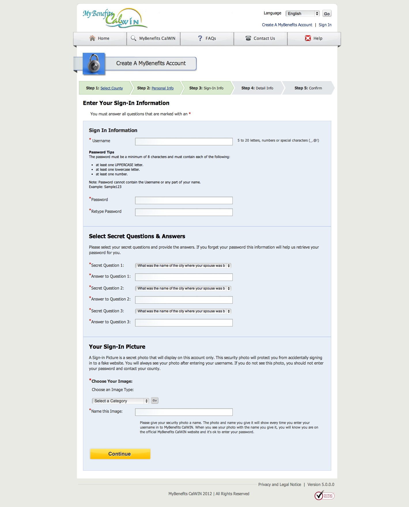

title: CalFresh Onboarding
style: ../styles.css
output: index.html
controls: true

--
# CalFresh
[CalFresh](http://www.calfresh.ca.gov/) is California's Food Stamps program. Residents in 18 counties can apply for CalFresh online through [My Benefits CalWin](https://www.mybenefitscalwin.org/). Let's see how it goes...
--

--

--

--

--

--

--

--

--

--

--

--

--

--

--

--

--

--

--

--

--

--

--

--

--

--

--

--

--

--

--

--

--

--

--

--

--

--

--

--

--

--

--

--

--

--

--

--

--

--

--

--
###Stats
- 50 screens
- 200 questions
- 2 errors
- 2 hours to apply
- 2 weeks until determination

--
# Thanks!
Made by [@lippytak](http://www.twitter.com/lippytak). Want more? [Check out how other government services onboard new users](http://www.lippytak.github.io/citizenonboard).
--