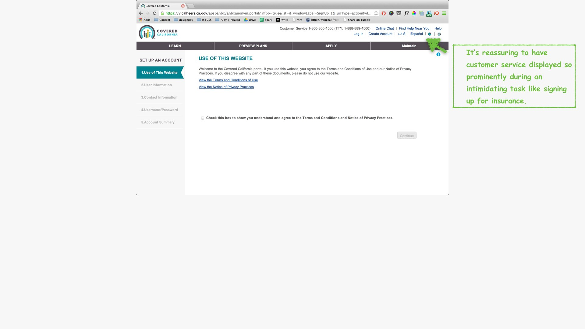
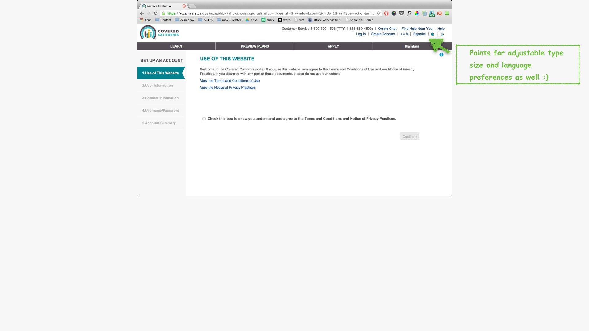
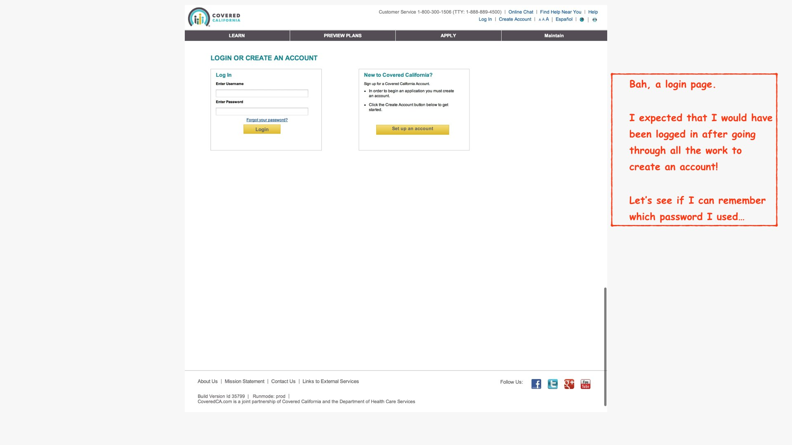
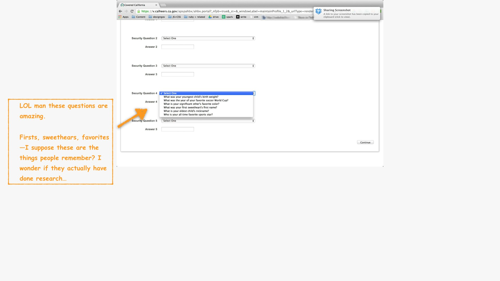
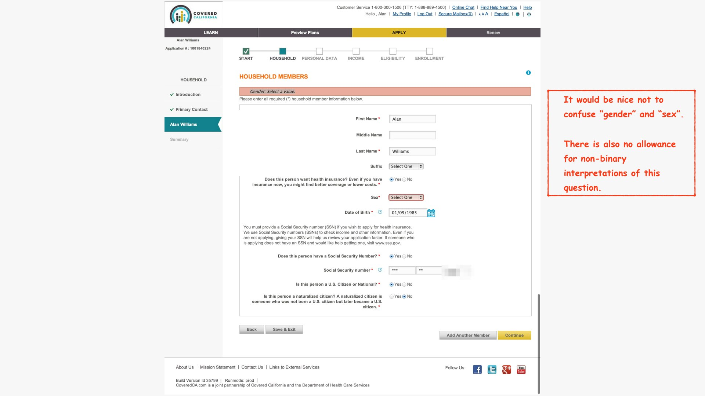
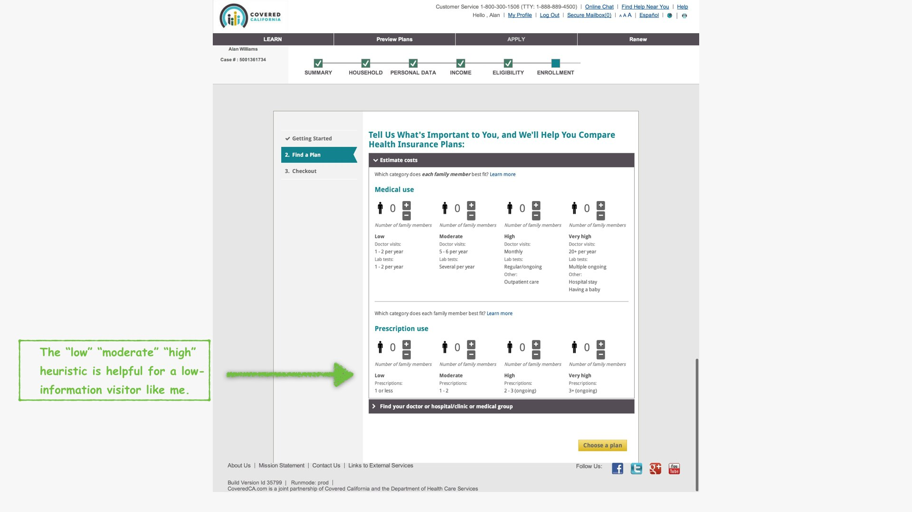
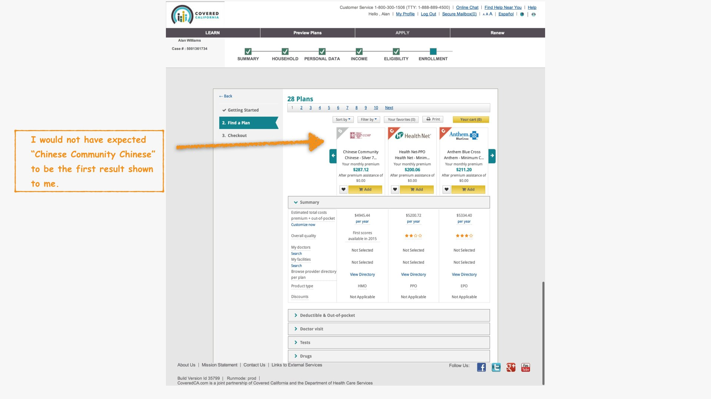
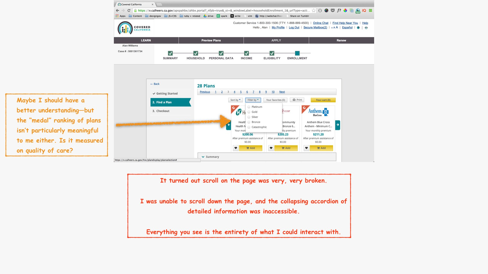
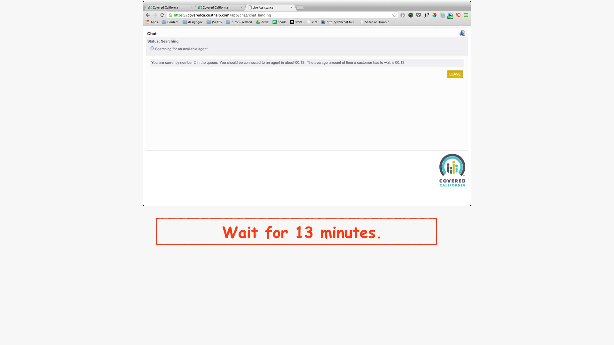

title: How CoveredCA onboards new users
style: ../../styles.css
output: index.html
controls: true

--
# How CoveredCA onboards new users
[CoveredCA](http://www.coveredca.com) is California's public healthcare exchange. Let's see how they onboard new users!
--

--

--

--

--

--

--

--

--

--

--

--

--

--

--

--

--

--

--

--

--

--

--

--

--

--

--

--

--

--

--

--

--

--

--

--

--

--

--

--

--

--

--

--

--

--

--

--

--

--

--

--

--

--

--

--

--

--

--

--

--

--

--

--

--

--

--

--

--

--

--

--

--

--

--

--

--

--

--

--

--

--

--

--

--

--

--

--

--

--

--

--

--

--

--

--

--

--

--

--

--

--

--

--

--

--

--

--

--

--

--

--

--

--

--

--

--

--

--

--

--

--

--

--

--

--

--

--

--

--

--

--

--

--

--

--

--

--

--

--

--

--

--

--

--

--

--

--

--

--

--

--

--

--

--

--
# Thanks!
This was another teardown from [CitizenOnboard](http://citizenonboard.com).

[Learn how to contribute your own!](https://github.com/codeforamerica/citizen-onboard#contribute)

Follow our progress and keep in touch!

 <form id="subscribe-form" method="post" action="http://tinyletter.com/CitizenOnboard">
    <input type="email" id="email" name="email" value="" placeholder="Enter your email address for loving updates">
    <button class="button" type="submit"> Subscribe </button>
</form>

