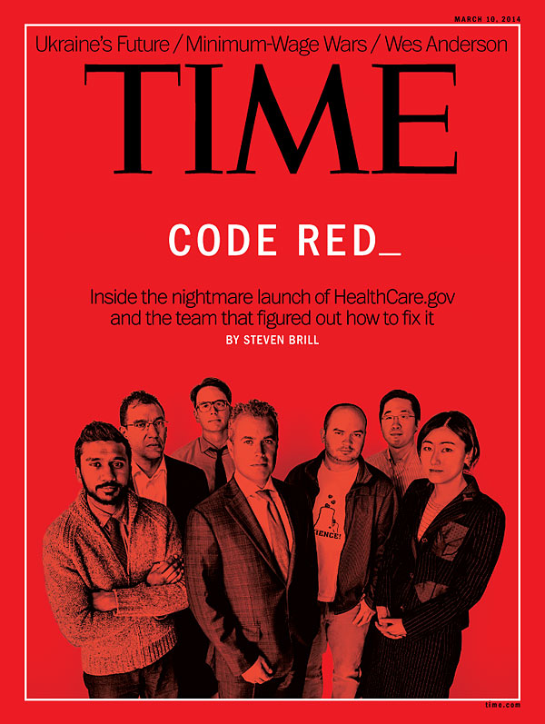
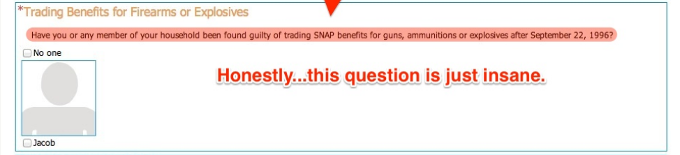
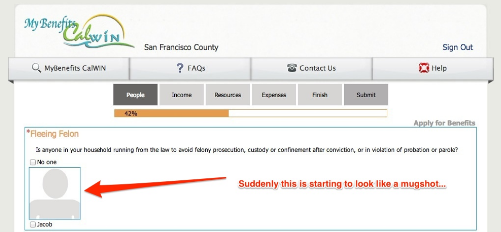

# CitizenOnboard is digital activism
When [HealthCare.gov](www.healthcare.gov) didn't work, it was a big deal:

<!--  -->

It was a crisis that demanded attention from the White house and an unprecedented intervention by a [surgical tech team](http://www.slate.com/articles/technology/bitwise/2013/12/healthcare_gov_nov_30_deadline_the_tech_surge_is_working.html). It was a national emergency. But once it started working, our attention drifted. 

CitizenOnboard is a reminder that the emergency isn't over:
>…one privilege the insured and well-off have is to excuse the terrible quality of services the government routinely delivers to the poor. Too often, the press ignores — or simply never knows — the pain and trouble of interfacing with government bureaucracies that the poor struggle with daily. That can allow the problems in those bureaucracies to fester. — [Ezra Klein](http://www.washingtonpost.com/blogs/wonkblog/wp/2013/10/25/obamacares-problems-go-much-deeper-than-the-web-site/)

[CitizenOnboard](citizenonboard.com) is a collaborative project to show how our own government services really work and don't work. Here's a glimpse into applying for Food Stamps in California:

<!--  -->

# Contribute
It's dead simple. You [send us the screenshots](http://dropitto.me/citizenonboard) (password = *onboard*) and we make the slideshow:

1. Save a bunch of **screenshots** using [Awesome Screenshot](https://chrome.google.com/webstore/detail/awesome-screenshot-captur/alelhddbbhepgpmgidjdcjakblofbmce?hl=en) (or something else)
2. **Number** them in order (*1-homepage.png*, *2-register.png*...)
3. **Annotate** them using [Glui](http://glui.me) or [Skitch](http://evernote.com/skitch/) (well, you don't *have* to annotate them, but it's the fun part!)
4. If you want, add a **readme.txt** with your contact info, a brief description of the service, and anything else you want to share
5. **Zip** it up
6. **Send us** the zip file: [www.dropitto.me/citizenonboard](http://dropitto.me/CitizenOnboard) (password = *onboard*)

We'll handle the rest and ping you know when the slideshow is up.

If you need ideas for teardowns, [check the issues](https://github.com/codeforamerica/citizen-onboard/issues). Above all else, do something that is important to the world and important to you.

If you have ideas for teardowns but don't want to do it yourself, [add an issue](https://github.com/codeforamerica/citizen-onboard/issues/new) and describe why it's important.

Questions? Reach out [@lippytak](http://twitter.com/lippytak)

# Applying for Food Stamps in California
The first of (hopefully) many. Check out [CitizenOnboard.com](http://citizenonboard.com) for more!

100% inspired by [@UserOnboard](https://twitter.com/UserOnboard)