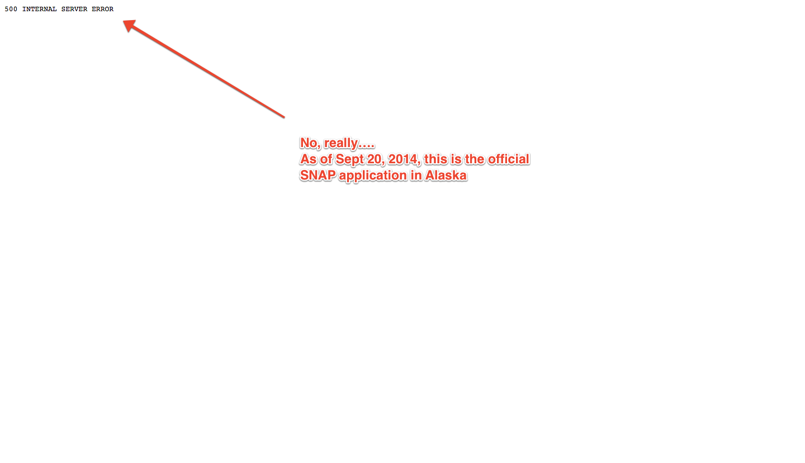
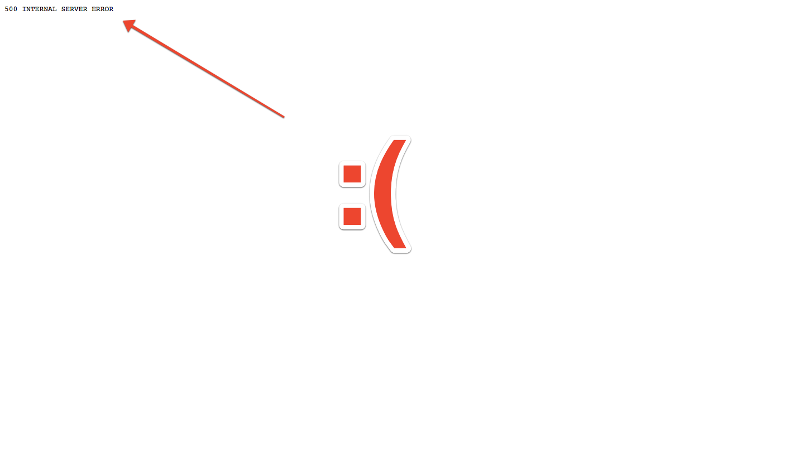

title: How Alaska SNAP onboards new users
style: ../styles.css
output: index.html
controls: true

--
# How Alaska SNAP onboards new users

--

--

--

--
# Thanks!
I know that one was short, but thanks for joining me anyway!

Want to contribute one of your own? [Join us on Github](https://github.com/codeforamerica/citizen-onboard#contribute).

Want to follow along? Subscribe to loving email updates:

 <form id="subscribe-form" method="post" action="http://tinyletter.com/CitizenOnboard">
    <input type="email" id="email" name="email" value="" placeholder="Enter your email address for loving updates">
    <button class="button" type="submit"> Subscribe </button>
</form>

