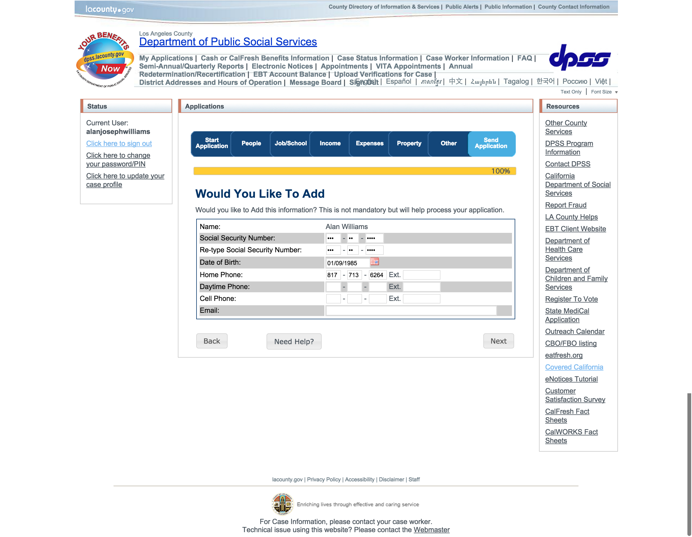

title: How Los Angeles onboards new CalFresh users
style: ../../styles.css
output: index.html
controls: true

--

--

--

--

--

--

--

--

--

--

--

--

--

--

--

--

--

--

--

--

--

--

--

--

--

--

--

--

--

--

--

--

--

--

--

--

--

--

--

--
# Thanks!

There's lots more to come so stay in touch!

 <form id="subscribe-form" method="post" action="http://tinyletter.com/CitizenOnboard">
    <input type="email" id="email" name="email" value="" placeholder="Enter your email address for loving updates">
    <button class="button" type="submit"> Subscribe </button>
</form>

